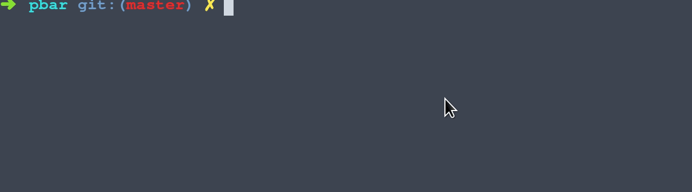
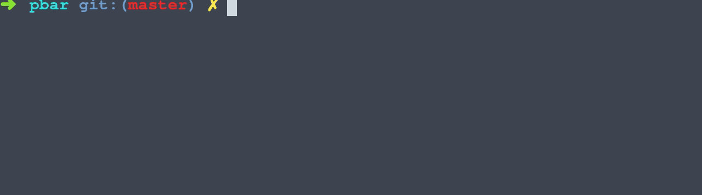

# pbar

[![Actions Status][ga-svg]][ga-url]
[![GitHub License][license-svg]][license-url]

[ga-svg]: https://github.com/koushiro/pbar/workflows/build/badge.svg
[ga-url]: https://github.com/koushiro/pbar/actions
[license-svg]: https://img.shields.io/github/license/koushiro/pbar?style=flat-square
[license-url]: https://github.com/koushiro/pbar/blob/master/LICENSE

This is a terminal progress bar library written in Rust,
inspired by [indicatif](https://github.com/mitsuhiko/indicatif),
[pb-rustlang](https://github.com/a8m/pb) and [pb-golang](https://github.com/cheggaaa/pb),
tested on Archlinux and Windows 10.

## Usage

Not publish to [crates.io](https://crates.io) yet, please add github repo into dependency.

```toml
[dependencies]
pbar = { git = "https://github.com/koushiro/pbar" }
```

### examples

1. Simple Progress Bar:

```bash
cargo run --example simple
```

```rust
extern crate pbar;

use std::thread;
use std::time::Duration;

use pbar::ProgressBar;

fn main() {
    let count = 1000;
    let mut pbar = ProgressBar::stdout(count);
    pbar.set_title("Simple:");
    for _ in 0..count {
        pbar.increase();
        thread::sleep(Duration::from_millis(10));
    }
    pbar.finish_with_msg("Done...");
}
```


2. Multiple Progress Bar:

```bash
cargo run --example multiple
```

```rust
extern crate pbar;

use std::thread;
use std::time::Duration;

use pbar::{MultiProgressBar, ProgressBarStyle};

fn main() {
    let mut multibars = MultiProgressBar::stdout();
    let style = ProgressBarStyle::default();

    let count: u64 = 1000;
    let mut bar1 = multibars.attach(count);
    bar1.set_title("item #1:")
        .set_style(style.clone());
    let _ = thread::spawn(move || {
        for _ in 0..count {
            bar1.increase();
            thread::sleep(Duration::from_millis(10));
        }
        bar1.finish_and_clear("item #1: done");
    });

    let mut bar2 = multibars.attach(count);
    bar2.set_title("item #2:")
        .set_style(style.clone());
    let _ = thread::spawn(move || {
        for _ in 0..count {
            bar2.increase();
            thread::sleep(Duration::from_millis(20));
        }
        bar2.finish_and_clear("item #2: done");
    });

    let mut bar3 = multibars.attach(count);
    bar3.set_title("item #3:")
        .set_style(style.clone());
    let _ = thread::spawn(move || {
        for _ in 0..count {
            bar3.increase();
            thread::sleep(Duration::from_millis(30));
        }
        bar3.finish_and_clear("item #3: done");
    });

    multibars.join_with_msg("All done...").unwrap();
}
```



3. Customizable Progress Bar:

```bash
cargo run --example year_progress
```

```rust
extern crate pbar;
extern crate chrono;

use pbar::{ProgressBar, ProgressBarStyle};
use chrono::prelude::*;

fn leap_or_normal(year: u32) -> u16 {
    if (year%4 == 0 && year%100 != 0) || year%400 == 0 {
        366
    } else {
        365
    }
}

fn main() {
    let dt = Local::now();
    let days = leap_or_normal(dt.year() as u32);
    let mut pbar = ProgressBar::stdout(days as u64);

    let mut style = ProgressBarStyle::customizable();
    style.counter(None, None)
         .percent()
         .bar(" ██░ ", Some(40));

    pbar.set_title(&format!("{} year progress:", dt.year())[..])
        .set_style(style);
    pbar.set(dt.ordinal() as u64, true);
}
```



### Customization

1. customizable progress bar

    ```rust
    let style = ...
    ...
    let mut pbar = ProgressBar::stdout();
    pbar.set_title("Title:")
        .set_width(80)
        .set_refresh_rate(Duration::from_millis(300));
    ```

2. customizable style

    ```rust
    let mut style = ProgressBarStyle::customizable();
    style.counter(None, None)       /// progress like 1234 / 10000
         .speed(None)               /// speed with format
         .percent()                 /// progress percent
         .bar(" ██░ ", Some(40))    /// bar symbols(begin/fill/current/empty/end), bar width(default 30)
         .time_left(None)           /// left time with format
         .str("/")                  /// just string, like delimiter string
         .time_elapsed(None)        /// elapsed time with format
         .str("/")
         .time_total(None);         /// left+elapsed time with format

    pbar.set_style(style);
    ```

## TODO

- [ ] add customizable spinner component
- [ ] add terminal color and attribute or use other crate instead of my term implement.
- [ ] more practical examples

## License

[MIT](./LICENSE)
